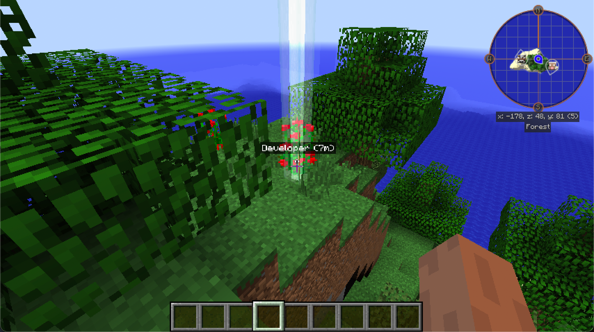
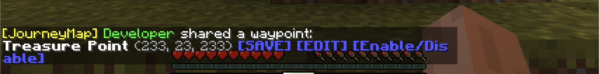
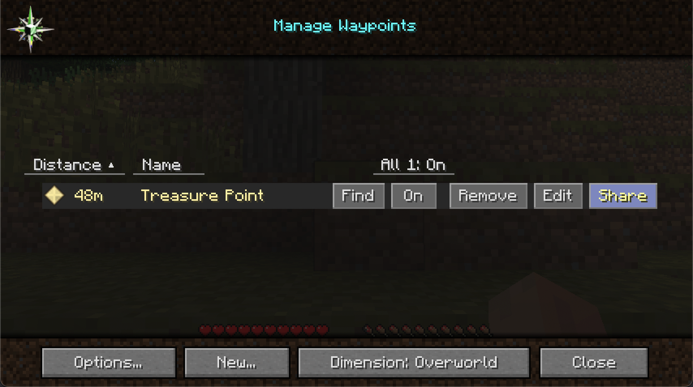
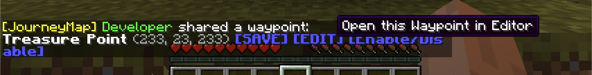
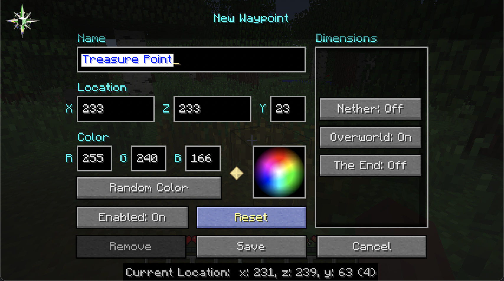
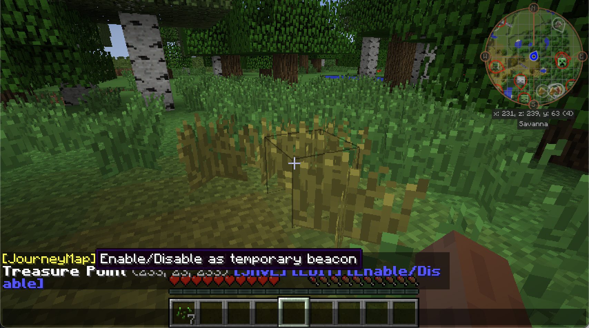
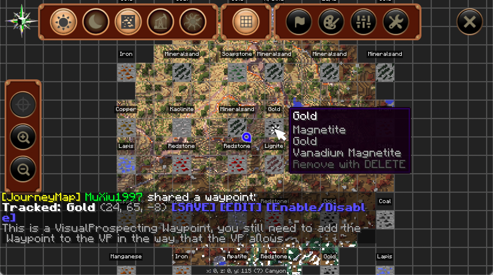

# Share Where I am

`Share Where I am` is a mod for Minecraft 1.7.10 + JourneyMap. It allows you to share your waypoint/location with other players.

🚨 Requires SpongeMixins as a dependency 🚨

## 1. Mark a position
Using a shortcut (<kbd>INSERT</kbd> by default) you can mark the position you are currently looking at, the marker(`Beacon`) will be present for 3 seconds and other players will be able to see your marker.

Or use a shortcut (<kbd>Shift</kbd> + <kbd>INSERT</kbd> by default) to mark where you are.

## 2. Share a waypoint

Using a shortcut (<kbd>Ctrl</kbd>+ <kbd>INSERT</kbd> by default) you can share the position you are looking at as a `Waypoint`.

Or use a shortcut (<kbd>Ctrl</kbd>+ <kbd>Shift</kbd> + <kbd>INSERT</kbd> by default) to share where you are. The same effect can be achieved using the command `/sharewhereiam`

_share waypoint message_

------
you can share your existing `Waypoint` in your `Waypoint Manager` :

_<kbd>Share</kbd> button in the `Waypoint Manager` screen_

------

1. Other players can just save this `Waypoint` (click `[SAVE]`)
   

    
Images

    
    
   

2. Or save after editing (click `[EDIT]`)

   

    
Images

    
    
   

3. Or temporarily make the `Waypoint` a beacon without saving it (click `[Enable/Disable]`)

   

    
Images

    
    
   

## Integration

### VisualProspecting

Now you can also share `VisualProspecting`'s  `Waypoint` (waypoint only, not vp record) with the above shortcut: use the shortcut (<kbd>INSERT</kbd> by default) on the `VP` icon (ore vein/TC node) in the `Fullscreen JMap`, however, for balance, you still need to add the `Waypoint` to the `VP` in the way that the `VP` allows

